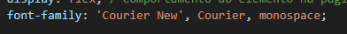

# form-CadEcommerce

<h1 align="center"></h1>

Projeto criado como parte avaliativa da disciplina de Fundamentos de Desenvolvimento Web ministrada pelo professor Leonardo Rocha.

## Índice

* [Descrição](#descrição)
* [Tecnologias](#tecnologias)
* [Referências](#referências)
* [Autor(a)](#autora)

### Descrição

O projeto consiste na composição de uma tela de login que possibilita o usuário inserir email e senha, porém sem realizar a entrada em um site.

### Resultado do Projeto

### Estilização

O projeto foi estilizado, utilizando CSS3. Foi criado um arquivo login.css. Nesse arquivo, constam configurações de estilo apresentadas a seguir:

* Estilo de cores:
    * background-color: altera cor de fundo.

* Estilo de fonte:
    * font-family: Permite definir uma lista de prioridades para famílias de fontes de um elemento selecionado.

* Estilização do container:
    * display: a propriedade especifica o comportamento de exibição (o tipo de caixa de renderização) de um elemento.;
    * justify-content: A propriedade alinha os itens do _container_ flexível quando os itens não utilizam todo o espaço disponível no eixo principal (horizontalmente);
    * align-items: Propriedade para alinhar os itens verticalmente;
    * width: A propriedade define a largura de um elemento;
    * heigth: A propriedade define a altura de um elemento.

## Tecnologias

* HTML5
* CSS3
* README
* Git
* Github

## Referências

[Alura](https://www.alura.com.br/artigos/escrever-bom-readme) - Como escrever um README incrível no seu Github 
[lohhans](https://gist.github.com/lohhans/f8da0b147550df3f96914d3797e9fb89) - Um modelo para fazer um bom README 
[Dio](https://www.dio.me/articles/personalize-o-readme-no-github) - Personalize o README no Github 
[mozilla](https://developer.mozilla.org/pt-BR/docs/Web/CSS/font-family) - Explica o uso do font-family 
[w3schools](https://www.w3schools.com/cssref/pr_class_display.php) - Explica o uso do display 
[w3schools - 2](https://www.w3schools.com/cssref/css3_pr_justify-content.php) - Explica o uso do justify-items e do align-items 
[w3schools - 3](https://www.w3schools.com/cssref/pr_dim_width.php) - Explica o uso do width 
[w3schools - 4](https://www.w3schools.com/cssref/pr_dim_height.php) - Explica o uso do heigth 

## Autor(a)

O projeto foi desenvolvido por:
 Vivian Oliveira Almeida