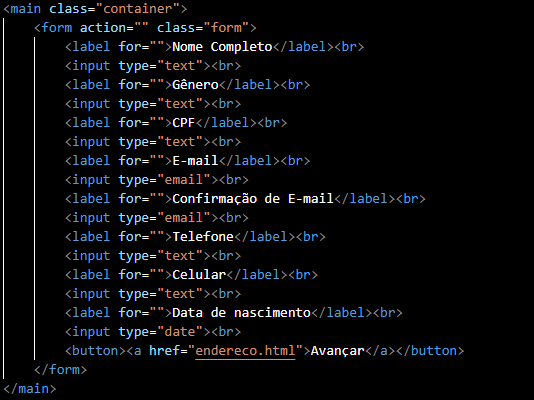

# form-CadEcommerce

<h1 align="center"></h1>

Projeto criado como parte avaliativa da disciplina de Fundamentos de Desenvolvimento Web ministrada pelo professor Leonardo Rocha.

## Índice

* [Descrição](#descrição)
* [Tecnologias](#tecnologias)
* [Referências](#referências)
* [Autor(a)](#autora)

### Descrição

O projeto envolve a criação de três telas de cadastro:

* A primeira tela solicita informações pessoais, incluindo nome, data de nascimento, sexo, endereço de email, entre outras.
* A segunda tela pede informações de endereço, como endereço completo, cidade, estado e cep.
* A terceira tela gera uma mensagem de confirmação de que o registro foi efetuado com sucesso.

O projeto foi desenvolvido durante a aula, utilizando diversos elementos do HTML5 e propriedades do CSS3.

### Resultado do Projeto

### Confecção

O projeto foi confeccionado, utilizando HTML5. Foi criado um arquivo form.html. Nesse arquivo, constam configurações apresentadas a seguir:

    * Main - Define o conteúdo principal dentro do body em seu documento ou aplicação.
    * Form - Define o formulário e os atributos que definem a maneira como esse formulário se comporta
    * Label - Dá nome para a área de escrita, seja e-mail ou senha.
    * Input -  Permite que o usuário escreva na página.
    * Button -  Cria um botão clicável.
    * a - Href - Se o elemento 'a' possuir o atributo 'href', ele representa um hiperlink (âncora de hipertexto) rotulado pelo seu conteúdo.

### Estilização

O projeto foi estilizado, utilizando CSS3. Foi criado uma pasta css, que inclui três arquivos. Nesse arquivo, constam configurações de estilo apresentadas a seguir:

* Estilo de cores:
    * background-color: altera cor de fundo.
    * color: altera cor do elemento

* Estilo de fonte:
    * font-family: Permite definir uma lista de prioridades para famílias de fontes de um elemento selecionado.

* Estilização do container:
    * display: a propriedade especifica o comportamento de exibição (o tipo de caixa de renderização) de um elemento.;
    * justify-content: A propriedade alinha os itens do _container_ flexível quando os itens não utilizam todo o espaço disponível no eixo principal (horizontalmente);
    * align-items: Propriedade para alinhar os itens verticalmente;
    * width: A propriedade define a largura de um elemento;
    * heigth: A propriedade define a altura de um elemento.

## Tecnologias

* HTML5
* CSS3
* README
* Git
* Github

## Referências

[Alura](https://www.alura.com.br/artigos/escrever-bom-readme) - Como escrever um README incrível no seu Github 
[lohhans](https://gist.github.com/lohhans/f8da0b147550df3f96914d3797e9fb89) - Um modelo para fazer um bom README 
[Dio](https://www.dio.me/articles/personalize-o-readme-no-github) - Personalize o README no Github 
[w3schools](https://www.w3schools.com) - informação sobre diversos elementos de html e css

## Autor(a)

O projeto foi desenvolvido por:
 Vivian Oliveira Almeida